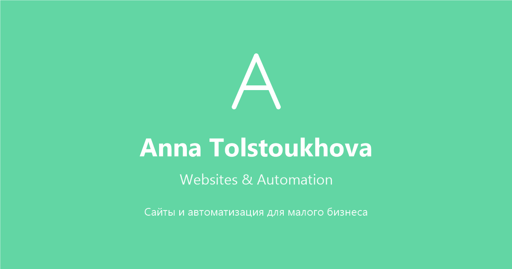

# Portfolio

A one-page portfolio: who I am, a grid of work, and a way to get in touch. One HTML file,
one stylesheet, one small inline script. No framework, no build step, no dependencies — the
only thing the page fetches from anywhere else is the webfont.

**Live:** https://tecna-developer.github.io/portfolio-ai/



## Highlights

- **Every tile is hand-drawn inline SVG.** Nine project tiles and a link to the GitHub
  profile, plus the brand mark, three contact icons and the copy icon — fifteen SVGs in all,
  no image files, no icon font. They stay sharp at any size, cost no extra requests, and take
  their colours from the same palette as the page, so a tile cannot drift out of step with
  the design.

- **The grid needs no breakpoint.** `repeat(auto-fill, minmax(132px, 1fr))` lets the number
  of tiles per row follow the available width. The one media query that touches it lowers
  the minimum to 104px on small screens; it does not redefine the layout.

- **Tile captions come from the markup, not a copy of it.** Each link carries
  `data-name="…"`, and `.tile::after` renders it with `content: attr(data-name)`. The label
  exists once, in the same element as the `href` and the `aria-label`.

- **Hover is not the only way to see a caption.** On desktop the label fades in on
  `:hover` *and* `:focus-visible`, so tabbing through the grid shows the same information a
  mouse does. Below 720px it is always visible, because a touch screen has no hover state —
  the gradient behind it is darkened there to keep the text legible over any tile.

- **The entry animation is staggered and optional.** Tiles fade in on `nth-child` delays
  from 0.25s to 0.70s. Everything — brand, intro, tiles, contacts — is switched off under
  `prefers-reduced-motion: reduce`.

- **The copy-email button degrades and reports.** It uses the async Clipboard API where the
  context allows it, falls back to a hidden `<textarea>` and `document.execCommand('copy')`
  otherwise, and only then decides what to show. Success turns the pill white; failure turns
  it red *and prints the address in the label*, so a refusal still leaves the visitor with
  the email. Either state resets after 2.2s.

- **Colour and type live in custom properties** — `--bg`, `--text`, `--text-soft`,
  `--tile-border`, `--shadow`, `--font` — so the mint palette is stated once.

- **The stylesheet is versioned in the link** (`style.css?v=3`). GitHub Pages caches
  aggressively, and bumping the query string is the whole cache-busting story here.

## Running it

There is no build step and nothing to install. Open `index.html` in a browser, or serve the
folder if you want a real origin:

```bash
npx serve
```

## Structure

```
index.html     the entire page: head, brand, intro, tile grid, contacts, copy script
style.css      all styles, ~250 lines, grouped by section
favicon.svg    the "A" mark
favicon.png    32x32 fallback for browsers without SVG favicon support
og-image.png   1200x630 social preview
img/           image assets
```

Class names follow a BEM-like convention (`.brand__name`, `.tile`, `.copy-email__icon`).
Sizing is in `px` — the page is small enough that a scale system would be ceremony.

## Adding a project

1. Copy an `<a class="tile">` block in `index.html`.
2. Set `href`, `data-name` and a descriptive `aria-label` — the label is what a screen
   reader announces, so say what the project is, not just its name.
3. Draw the artwork inside as an inline `<svg viewBox="0 0 100 100">`, using the palette the
   neighbouring tiles use.
4. If it lands past the tenth tile, add an `nth-child` delay so it joins the cascade.

## Scope

A static index. The tiles link out, the contact icons link out, and the copy button is the
only behaviour on the page.

Two leftovers worth knowing: `img/anna.jpg` is committed but referenced nowhere, and
`v1-dark/` — an earlier dark-theme version of this page — is kept locally and listed in
`.gitignore`, so it is not part of the repository.
